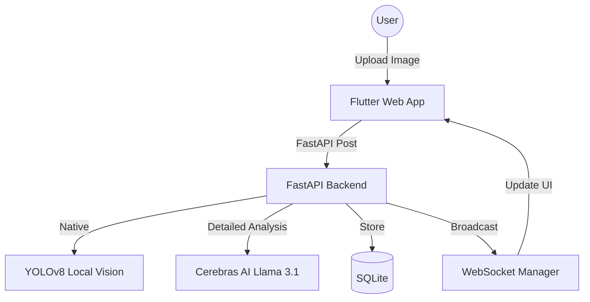

#  CleanCity AI


> **Transforming Urban Sanitation through AI-Powered Civic Coordination.**

CleanCity AI is a state-of-the-art smart civic platform designed to bridge the gap between citizens, volunteers, and municipal authorities. By leveraging advanced Machine Learning and real-time coordination, we turn city cleanup into a rewarding, gamified experience.

---

## 🌟 Key Features

### 🧠 Intelligent Waste Analysis
- **Local Vision (YOLOv8):** Instant detection of waste items (plastic, metal, organic) directly in the app.
- **Deep Reasoning (Cerebras AI):** Utilizes Llama 3.1-70B to analyze report severity, assess environmental impact, and provide professional insights.
- **Auto-Severity Mapping:** Automatically prioritizes reports based on waste volume and potential hazards.

### 📍 Real-time Civic Map
- **Live Clustering:** Interactive map powered by `flutter_map` that clusters reports for easy visualization.
- **Smart Routing:** Identifies high-density waste zones to optimize volunteer cleanup drives.
- **Proof of Work:** Requires "After" images for every cleanup, verified by AI to prevent fraud and ensure accountability.

### 🎮 Advanced Gamification
- **Points & Badges:** Earn points for reporting and cleaning. Unlock badges like *Eco Warrior* or *City Saver*.
- **Trust Score:** A dynamic reputation system that grows as your reports are verified by the community.
- **Live Leaderboard:** Real-time ranking of top contributors via WebSockets.

---

## 🛠️ Tech Stack

| Component | Technology |
| :--- | :--- |
| **Frontend** | Flutter (Web/Mobile), Provider State Management |
| **Backend** | FastAPI (Python), SQLAlchemy, SQLite |
| **AI (Vision)** | YOLOv8 (Ultralytics) |
| **AI (Reasoning)** | Cerebras Cloud SDK (Llama 3.1 70B) |
| **Real-time** | WebSockets (Broadcasting updates) |
| **Mapping** | OpenStreetMap (Leaflet/Flutter Map) |

---

## 🚀 Getting Started

### ⚡ Quick Start (Windows)
If you are on Windows, you can start both the backend and frontend with a single command:
```powershell
./run.bat
```
*This will automatically launch the FastAPI server and the Flutter web app in separate windows.*

---

### 🛠️ Manual Setup
#### 1. Backend Setup
```bash
# Navigate to backend
cd backend

# Install dependencies
pip install -r ../requirements.txt

# Configure Environment
# Create a .env file with:
# CEREBRAS_API_KEY=your_key_here

# Run the API
uvicorn main:app --reload
```

### 2. Frontend Setup
```bash
# Navigate to frontend
cd frontend

# Install Flutter packages
flutter pub get

# Launch for Web
flutter run -d chrome
```

---

## 📊 System Architecture



---

## 🛤️ Future Roadmap
- [ ] **Decentralized Rewards:** Integration with blockchain for verifiable "Proof of Cleanup" tokens.
- [ ] **Authority Dashboard:** Specialized portal for municipal workers to manage high-priority tasks.
- [ ] **AI-Driven Routing:** Optimize trash collection truck routes based on real-time report density.
- [ ] **Community Challenges:** Organize weekly cleanup events with sponsored rewards.

---

## 🤝 Contributing
We welcome contributions! Please feel free to submit a Pull Request or open an issue.

1. Fork the Project
2. Create your Feature Branch (`git checkout -b feature/AmazingFeature`)
3. Commit your Changes (`git commit -m 'Add some AmazingFeature'`)
4. Push to the Branch (`git push origin feature/AmazingFeature`)
5. Open a Pull Request

---

<p align="center">
  Proudly built for a cleaner, smarter tomorrow. 🌍
</p>
